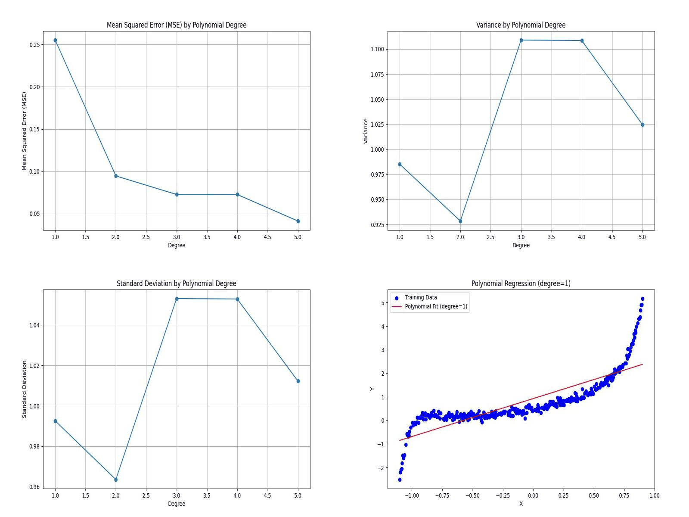

# Assignment 1 Report

## Question 1

### KNN Implementation

For task 1, using the different plots, an observation was developed that mode, unnamed track id, and key are not relevant to the genre prediction.
Thus they were dropped from th training set altogether from the feature vectors.

### Hyperparameter tuning

The best k was coming around 21 in this implementation along with manhattan distance being the best metric.

## Question 2

### 3.1.1
The MSE, Std, and Var are being output on running the file.

### 3.1.2
The minimized k has been reported, and it is found that on increasing k, tested here for values from 1 to 5, the error statistics on all 3 tests go down. So k=5 is the minimum parameter, but alongside that extensive testing for different k values was carried out in the scripts. 

### 3.1.3

The GIF has been made with 5 varying values of k, from k = 1:5. The inference drawn was that on decreasing k, behind the overfitting regime, the error generally decreases. 
An observation depicted in the gif is that degree 3 and 4 have very little difference in their stastical observations as well as their graphs.

## Regularization

### 3.2.1

The observations are in the general sense that as the degree of the curves increases, the model fits the 'noise' very well, which is why its performance metrics go down on the testing data. However, for the particular data given, at least up till 20, on randomly sampling the testing data samples, it was founf that error was shooting up on some values like k=16 , hoever even without strict l1 or l2 regularization, we have error decreasing on the testing data.

