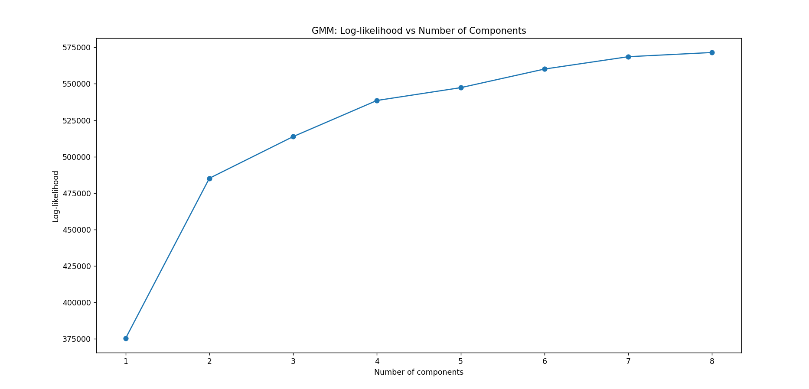
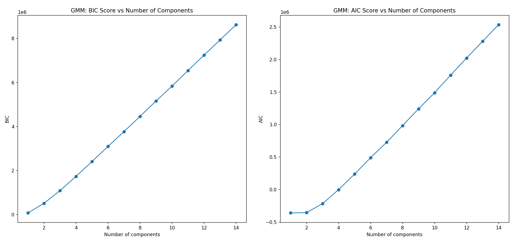

# Assignment 2 Report

### 3.1

Implemented K-Means class.

### 3.2

Plot of cost agains number of clusters k :  

**Parameters :**

**$k_{kmeans1}$ = 8**

+ This is the point in the cost vs component graph after which the relative change in the cost with the increasing k slows down.

### 4.1

Implemented GMM class.

### 4.2

Plots for likelihood analysis against number of clusters : 

<h2 align="center">Log-Likelihood for Custom GMM</h2>

<h2 align="center">AIC-BIC Analysis for inbuilt sk-learn gmm</h2>

<h2 align="center">AIC-BIC Analysis for normalized data using sk-learn</h2>

<h2 align="center">AIC-BIC for custom implemented gmm class</h2>

**Observations :** 

+ The grouping of words into clusters agrees with the semantic sense of the words. This suggests that the custom implemented gmm class works  fine.

+ The increasing log likelihood with the number of clusters k indicates the use of a higher value of k for clustering leads to better grouping.

+ The AIC and BIC criterion analysis for both the inbuilt sklearn class and the custom implementation are the same.
   + After performing PCA later, the AIC and BIC criterion give a better estimate of the optimum number of clusters.

**Parameters :**

**$k_{gmm1}$ = 2**

+ The AIC and BIC analysis is leading to this value of optimum cluster components. The reason for this inaccurate analysis is that AIC and BIC are information theoretic measures which don't actually report which k value leads to the best clustering, but rather they weigh the relative dependence of the two terms involved in theor expression and report that k which seems optimum as per that methodology.
+ Thus, while we know that $k_{gmm1}$ = 2 is not a good way to cluster words having a vast variety in semantics, yet it is what the analysis gives, for bith the inbuilt class as well for the self implemented class. 

### 5.1

Implemented PCA class.

### 5.2

The dataset after dimensionality reduction : 

### 5.3

**Observations from the 2D Plot :**

+ The X-Axis dimension seems to quantify the ***ability to action or move*** attribute of the entity. Hence, we observe that animals , such as bear, elephant, cow, panda are on the left side while hard, scary, happy, fire are clustered on the right side.

+ The Y-Axis dimension seems to quantify something similar to ***usability in context of verbi-ness*** of the entity, which is why we observe that teaspoon, door, notebook are clustered on the higher side while dig, run, eat are on the lower side.

**Observations from the 3D Plot :**

+ The Z-Axis dimension seems to segregate the words which correspond to **living beings**, which is why almost all the animals are clustered right at the top with the other two dimensions used to qualify other aspects.

**Parameters :**

**${k_2}$ = 4**

+ The above stated value seems visibly appropriate for clustering.

### 6.1 

Performed K-Means clustering using $k_{2}$.

### 6.2

Scree Plot :

 

**As stated in the graph above, 95% of the variance is explained by the first 133 dimensions corresponding to the largest 133 eigen values.**

 

+ For the reduced dataset, $k_{kmeans3}$ = 9$ seems optimum for clustering based on the above elbow plot.

**Parameters :**

**$k_{kmeans3}$ = 9$**

### 6.3 

Performed GMM using ${k_2}$ .

### 6.4

AIC BIC for Reduced Dataset :

**Observation :**

+ As per the AIC and BIC analysis, now we see the expexted ***V - Curve*** for the AIC - BIC plots.
+ The value corresponding to the  lowest value of the AIC curve is chosen as the  optimum k for clustering.

**Parameters :**

**$k_{gmm3}$ = 5**

### 7.1

### 7.2

### 7.3

### 8 

### 9.1 

 

**As seen above, the 90% variance is explained by the first 12 components.**

 

Dimensionality reduction applied to ruduce the dimensions from 21 to 12.

 

**Parameters**

**Distance metric = Manhattan**
**K=21**

### 9.2

**Observations**

**Accuracy on validation = 0.1840**
**Precision on validation = 0.1519**
**Recall on validation = 0.1806**
**F1 score on validation = 0.1444**

**Comparison**

+ The KNN model gives nearly the same accuracy and performance metrics for the dimensionally reduced dataset as the original dataset.
The model however works signifacantly faster than the original which worked on all the dimensions.

+ Thus, there is a great improvement in terms of computational efficiency and only a slight deviation in the accuracy.

