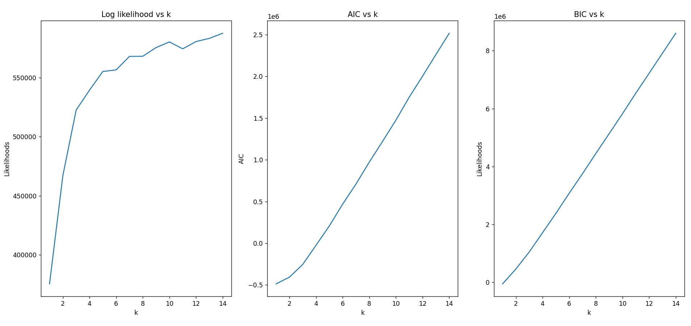

# Assignment 2 Report

### 3.1

Implemented K-Means class.

### 3.2

The optimal k obtained using K-Means is : 

**k_kmeans1 = 8**

This is the point in the cost vs component graph after which the  relative change in the cost with the increasing k is less.

### 4.1

Implemented GMM class.

### 4.2

**Observations :** 

+ The grouping of words into clusters agrees with the semantic sense of the words. This suggests that the custom implemented gmm class works  fine.

+ The increasing log likelihood with the number of clusters k indicates the use of a higher value of k for clustering leads to better grouping.

+ The AIC and BIC criterion analysis for both the inbuilt sklearn class and the custom implementation are the same.
   + After performing PCA later, the AIC and BIC criterion give a better estimate of the optimum number of clusters.

**Parameters :**

+ $k_{kmeans}$

### 5.1

Implemented PCA class.

### 5.2

The dataset after dimensionality reduction : 

### 5.3

As per me : 

........

Estimated k2 : 

k2 = 4

### 6.1 

Performed K-Means clustering using k2.

### 6.2

Scree Plot :

### 6.3 

Performed GMM using k2.

### 6.4

AIC BIC for Reduced Dataset :

